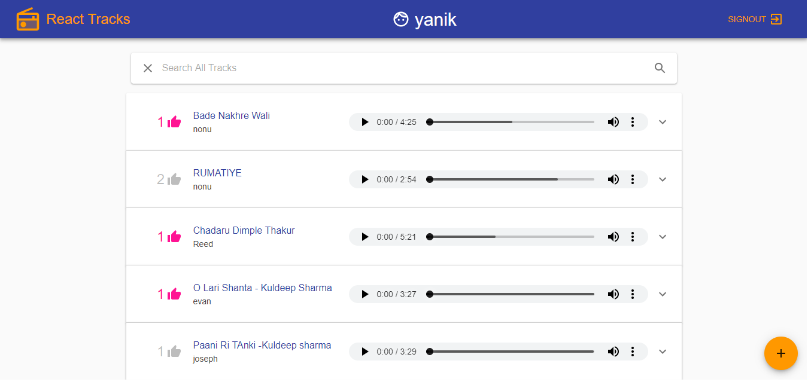
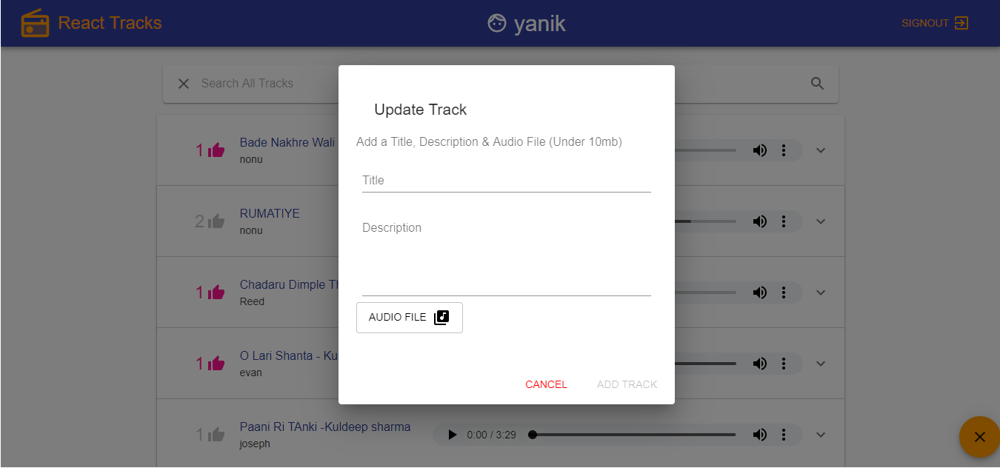

# React-Music-Tracks
**A Music Web Application made using React JS**
Project features the following content:
* > Authorization
  * > Register User 
  * > Login User
* > All Tracks 
* > Profile
  * > Creted Tracks
  * > Liked Tracks
  * > Date Joined w/ Profile Name
* > Upload Tracks
  * > Edit Tracks
  * > Delete Tracks
  * > Like Tracks
* > Audio Player and for Downloading


## Front End:
Project is made using **React JS** and using number of **React Hooks**.
The whole UI is a **Material UI** i.e. of React and bunch of more tools are used for application to work.

On client **GraphQL** is used with the help of apollo client and apollo-boost.
**(GraphQL is a query language for your API, and a server-side runtime for executing queries by using a type system you define for your data. GraphQL isn't tied to any specific database or storage engine and is instead backed by your existing code and data.)**


## Backend:
Backend of this application is of **Python's best known framework for Web Development i.e. Django**.
whole backend runs usng python.
Everything was made on the top of **GraphQL** backend that was only made wiht **Django and Graphene (Graphene-Python is a library for building GraphQL APIs in Python easily)**

## Storage Service:
The Storage service used to store the data that is for saving the files uploaded to the application is on **Cloudinary**
All the tracks which is being uploded by the user is storted in the cloudinary which is an online cloud storage service for storing data of your development.


### NOTE: After cloning the repository to make it work, don't forget to install dependencies for react-tracks-client folder and starting the python server in the app folder for running the backend.

In react-tracks-client folder **npm install --save** for installing all the usage dependencies and start the server using **npm start**
and in another command line
In app folder start the shell using **pipenv shell** command then start server by **python manage.py runserver**

```Also make sure you add your cloudinary name inside of the CreateTrack.js file in handleAudioUpload```

> Below shown some ScreenShots of the project 

    
                                           




